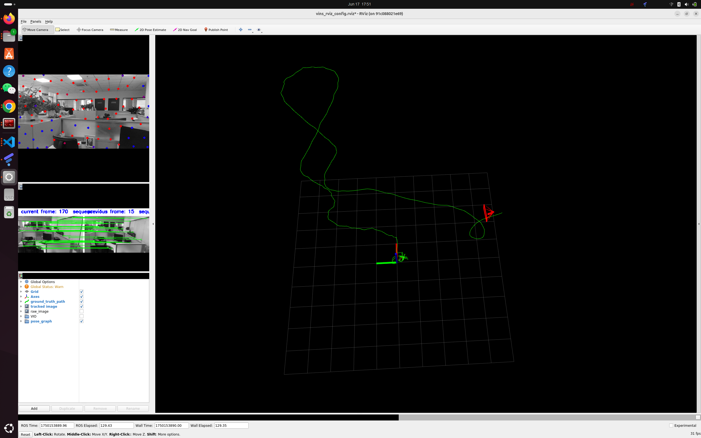

# D435i---VINS-Mono
- 该项目旨在介绍D435i相机在VINS Mono中的应用,打通整个流程,也方便各位researcher后续使用
- 需要说明的是,我使用的是ubuntu版本是24.04,只能下载ros2,想用ros1的话需要安装docker. 如果你系统还没装,建议使用ubuntu20.04,这样ros1和ros2可以并存,VINS Mono目前只在ros1中测试过

## 在ubuntu上安装必需程序
### **步骤1: 安装ros2和docker**
**Recommended Versions**:
- ROS 2: `Jazzy`  
- Docker: `ROS Noetic`  

**快速安装命令**:
```
wget http://fishros.com/install -O fishros && . fishros
```
- 一键安装ros <a href="https://github.com/fishros" target="_blank" rel="noopener noreferrer nofollow ugc">贡献@小鱼</a>
- 一键安装docker <a href="https://github.com/alyssa1024" target="_blank" rel="noopener noreferrer nofollow ugc">贡献@alyssa</a>

### **步骤2: 安装RealSense-Ros**
- 下载最新的[英特尔® 实感™ SDK 2.0](https://github.com/IntelRealSense/librealsense)
- 安装[官方说明](https://github.com/IntelRealSense/librealsense/blob/master/doc/installation.md)进行安装

### **步骤3: 安装安装英特尔® 实感™ ROS2 包装器** <a href="https://github.com/IntelRealSense" target="_blank" rel="noopener noreferrer nofollow ugc">贡献@ Intel® RealSense™</a>

- [配置ubuntu存储库](https://wiki.ros.org/Installation/Ubuntu/Sources)
- 安装所有realsense ROS 软件包`sudo apt install ros-<ROS_DISTRO>-realsense2-*` 

### **步骤4: 安装kailb** (从步骤4及后面是安装在docker里的程序)
- 参考[官方教程](https://github.com/ethz-asl/kalibr/wiki/installation)进行安装
- 该程序用于标定相机内参和相机-imu参数

**标定相机内参**
运行下面代码会生成camera-camchain.yaml文件,里面有相机的各项参数设置.
```bash
source /home/hgl/kalibr_ws/devel/setup.bash
rosrun kalibr kalibr_calibrate_cameras --bag <your_bag> \
--topics /camera/camera/color/image_raw \
--models pinhole-radtan \
--target checkerboard.yaml \
--show-extraction
```

**标定相机-imu参数(需要先标定imu才可以运行该代码)**
```bash
rosrun kalibr kalibr_calibrate_imu_camera \
--bag <your_bag> \
--cam camera-camchain.yaml \
--imu imu.yaml \
--target checkerboard.yaml \
--show-extraction
```


### **步骤5: 安装[code_utils](https://github.com/gaowenliang/code_utils)和[imu_util](https://github.com/gaowenliang/imu_utils)**
- 参考[非晚非晚博客](https://blog.csdn.net/QLeelq/article/details/114652777)安装使用,可以标定imu.


### **步骤6: 安装VINS Mono**
- 参考[官方教程](https://github.com/HKUST-Aerial-Robotics/VINS-Mono)安装,配置yaml文件后成功运行.


| Demo |
|:------------:|
| 1 |
|  |
| 2 |
|  |
| 3 |
|  |
| 4 |
|  |


- 前三次运行时我是绕了一大圈,VINS Mono中给出的结果并不好,可以看出起始点和最终点差别很大.
- 第四次是只绕了一个小圈,得到了一个相对较好的结果


**PS. 目前只是把各部分的安装教程以及大体流程梳理好,后面还需要针对各部分进行一个详细的阐述.**

